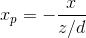

# CH.1 Graphics Systems and Models

## 1.1 Application of Computer Graphics
**Design** is an *iterative* process.
In real world, a problem with a unique optimal solution is rare.

**Design problems** are either
1. Overdetermined: no optimal solution exists
2. Underdetermined: multiple solutions exist

Design, test, and use the result as the basis for exploring other solutions.

- To **describe** objects -> solid modeling techniques
- To describe **more complex** objects -> free form curves
- In addition -> calculating intersections of curves, surfaces, and solid objects

### Geometric modeling
The process of constructing a complete mathematical description of the shape of a physical object

### Computer Graphics
Visual display and manipulation of geometric models.

## 1.2 A Graphics System
1. input
2. processor(CPU)
3. graphics processor(GPU)
4. frame buffer
5. output

### Pixels and Frame Buffer
The pixels are stored in a part of memory called the frame buffer.

#### k-bit plane
k bits/pixel

### High Dynamic Range
use 12 or more bits for each color component

### Output Devices

#### Display Device: Monitor

##### Persistence
To maintain a steady flicker-free image, at least 50Hz

##### Cathode Ray Tube(CRT)
Electron gun -> Beam focusing unit -> Deflection system -> Phosphor coating on the back of screen

###### Random (vector) scan
- High resolution, but requires expensive circuitry to achieve high refresh rete

###### Raster Scan Display
- Evolved from television technology
- Interlaced and noninterlaced systems

#### Interlace
odd rows and even rows are refreshed alternately

## 1.3 Images: Physical and Synthetic

### Objects and Viewers
It is the **viewer** that forms the image of an object, need light sources

### Image Formation Models

#### Ray tracing and photon mapping
A ray is a semi-infinite line that emanates from a point and travels to infinity in a particular direction.

#### Radiosity
Image formation based on conservation of energy. works best for surfaces that scatter the incoming light equally in all directions.

## 1.4 Imaging Systems

### The Pinhole Camera
The projection of the point

#### The Ideal Pinhole Camera
1. has an infinite depth of field: every point within its field of view is in focus.
2. admits only a single ray from a point source;
3. cannot be adjusted to have a different angle of view.

#### Real Camera
1. do not have an infinite depth of field;
2. more light can pass through;
3. any desired angle of view can be achieved by using a lens with proper focal length = d for pinhole camera

## 1.5 The Synthentic-Camera Model

### How 2-D images are formed?

#### Basic Principles:
1. There should be separate functions for specifying the objects and the view
2. Compute the image using geometric calculations, the flipping can be avoided by placing the image plane in front of the lens at a distance *d*.
3. Virtual Camera can only see part of the world space.

## 1.6 The Programmer's Interface
The API should include functions to specify the followings:

1. Objects
2. A Viewer
3. Light Sources
4. Material Properties